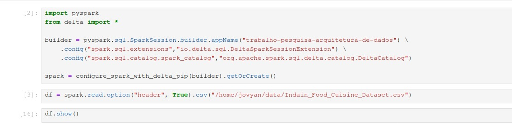
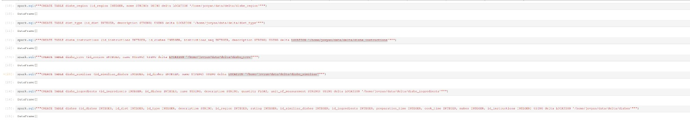
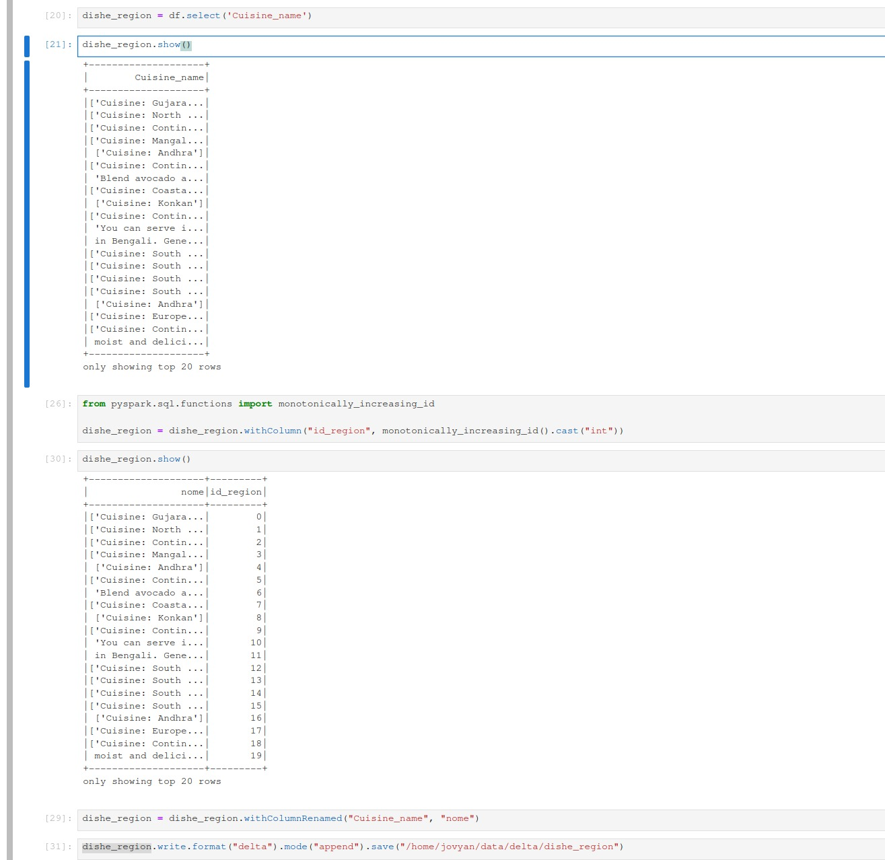
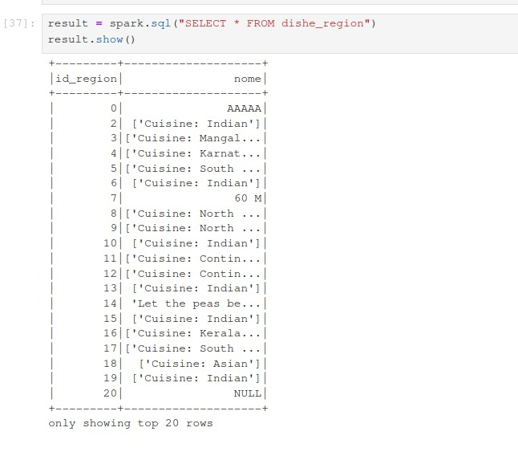
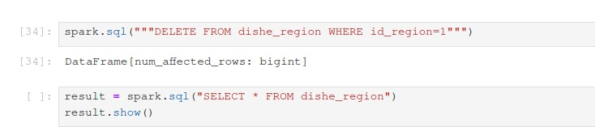
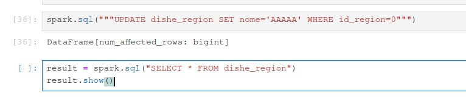

# trabalho-pesquisa-arquitetura-de-dados :space_invader:

## Image Docker :whale:

De pull na seguinte imagem <b>docker pull quay.io/jupyter/pyspark-notebook</b>.
 
Logo apos a instalacao da image, execute o container com o seguinte comando <b>docker run -p 10000:8888 quay.io/jupyter/pyspark-notebook</b>.

## Repositorio :robot:

Clone o repositorio com <b>git clone</b>.
 
Depois do repositorio clonado, abra um terminal dentro do projeto e executo o comando <b>docker compose up</b> e apos o termino da execucao acesse a url <em>http://127.0.0.1:8888/+tokengerado</em> no terminal.

## Dentro do projeto

- Incia sessão, declara configs e bibliotecas e cria dataframe pelo CSV
  
  

- Criando as tabelas
  
  

- Inserindo dados na tabela, (utilizando sem ser a sintaxe SQL-like para não precisar criar um tabela temporaria)
  
  

- Select em uma tabela
  
  

- Delete em uma tabela
  
  

- Update em uma tabela

  
